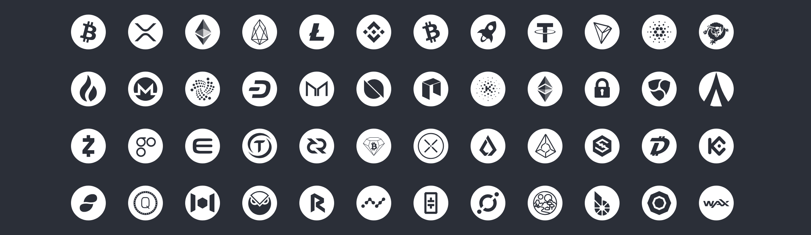

[](https://www.npmjs.com/package/vue-cryptoicon)    [](https://www.npmjs.com/package/vue-cryptoicon) [](https://www.npmjs.com/package/vue-cryptoicon) [](https://github.com/man15h/vue-cryptoicon/blob/master/LICENSE)


# vue-cryptoicon

Beautiful pixel perfect 400+ cryptocurrency and 10+ Fiat currency icon, in a range of styles and sizes




## [Demo](https://vue-cryptoicon.netlify.com/)


## Install

### NPM

Installing with npm.

```js
npm install vue-cryptoicon // yarn add vue-cryptoicon
```

## Quick start

### Global

To use in your project, just import vue-cryptoicon and install into Vue.

main.js

```js
import Vue from 'vue';
import Cryptoicon from 'vue-cryptoicon';
// For all icons
import icon from 'vue-cryptoicon/src/icons';
Cryptoicon.add(icon);
Vue.use(Cryptoicon);

// selective icons 
import { Btc, Eth, Xrp, Eos, Bnb, Tron } from 'vue-cryptoicon/src/icons';
Cryptoicon.add([Btc, Eth, Xrp, Eos, Bnb, Tron]);
Vue.use(Cryptoicon);


```

App.vue

```html
<template>
    <!-- Bitcoin color icon-->
    <cryptoicon symbol="btc" size="24" />  
    <!-- Bitcoin blue color icon-->
    <cryptoicon symbol="btc" size="24" color="blue" />
    <!-- Bitcoin  black (#000)  icon-->
    <cryptoicon symbol="btc" size="24" color="#000" />
</template>
```

## Props

| Name          | Description          | Type         | Default        | Accepted values          |
| ------------- | -------------------- | ------------ | -------------- | ------------------------ |
| `symbol`      | Cryptocurrency symbol| `String`     | -              | Valid and Available      |
| `color`       | Color of the symbol  | `String`     | color          | HEX or color name        |
| `size`        | Size of the icon     | `Number`     | 24             | Positive integer         |

### Advance

You can change the default value of `size` and `color` in `main.js`

```js
Vue.use(Cryptoicon, { size: '50', color: 'black' });
```


## License

[MIT](LICENSE) license.

## Special Thanks 👏

[Atomic labs]('https://github.com/atomiclabs') for [svg icons](https://github.com/atomiclabs/cryptocurrency-icons/)